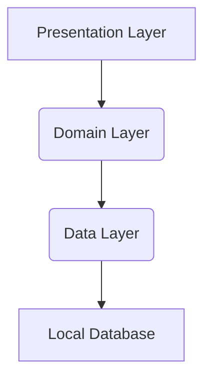

# Quit Journey 焕新之旅


## 🌟 功能特性
- 匿å用户快速æ¥å…¥
- 戒烟计划个性化é…ç½®
- å®æ—¶æ•°æ®çœ‹æ¿

## 🚀 快速开始
```bash
flutter pub get
flutter run
```

## 🗠技术æ¶æ„

```mermaid
graph TD
  A[Presentation Layer] --> B(Domain Layer)
  B --> C(Data Layer)
  C --> D[Local Database]
```

## 📄 å¼€æºåè®®
MIT License
